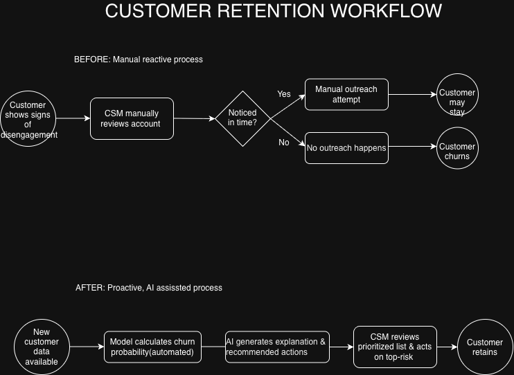

# SaaS Churn Prediction & AI-Driven Retention System

An end-to-end analytics project that identifies at-risk SaaS customers, quantifies revenue at risk, and generates AI-powered retention recommendations.

---

## Business Problem

SaaS companies lose recurring revenue when at-risk customers churn without warning, often because manual monitoring can't keep pace with the volume of accounts. This project identifies the key drivers of churn, quantifies monthly recurring revenue (MRR) at risk, and recommends specific retention actions — proactively, before customers cancel rather than after.

## Objectives

- Identify the key drivers of customer churn
- Quantify monthly recurring revenue (MRR) at risk
- Predict which active customers are likely to churn
- Generate plain-English, actionable retention recommendations using AI
- Present findings in a business-facing, interactive dashboard

Full requirements and user stories are documented in [`/docs/BRD.md`](docs/BRD.md).

## Dataset

This project uses the public **Telco Customer Churn** dataset (Kaggle). While the raw data is from telecom, its subscription/contract/tenure structure closely mirrors SaaS churn patterns (month-to-month vs. annual contracts, recurring monthly billing, add-on services), so it's treated here as a SaaS retention case study.

Source: [Kaggle — Telco Customer Churn](https://www.kaggle.com/datasets/blastchar/telco-customer-churn)

---

## Key Findings

- **Overall churn rate:** 26.54% of customers
- **MRR at risk:** $139,130.85 lost to churned customers (30.5% of total MRR)
- **Contract type is the strongest churn driver:** Month-to-month contracts churn at 42.71% vs. 11.27% for one-year and 2.83% for two-year contracts
- **New customers are highest-risk:** Customers with 0–12 months tenure churn at 47.44% vs. 9.51% for customers past 49 months
- **Missing add-on services correlate with churn:** Customers without Tech Support churn at 41.64% vs. 15.17% with it (similar pattern for Online Security and Device Protection)
- **Payment method signals risk:** Electronic check payers show the highest churn rate at 45.29%, notably higher than automatic payment methods
- **20 high-value customers** above average monthly spend churned in this dataset — see `sql/04_at_risk_customers.sql` (query) and `exports/high_value_at_risk.csv` (results)
- **Internet service type is a strong signal:** Fiber optic customers churn at 41.89% vs. 18.96% for DSL and just 7.4% for customers with no internet service — this is the model's single strongest churn-driving factor, and a clear candidate for retention investigation (e.g., service reliability, pricing, or bundling issues specific to fiber plans).

---

## Dashboard


**[View Interactive Dashboard on Tableau Public →](https://public.tableau.com/app/profile/syeda.misbah.hussain./viz/Book1_17898348248600/Dashboard1)**

### Chart Selection Rationale

Each visualization was chosen based on the type of relationship in the data, not visual preference:

| Chart | Used For | Why |
|---|---|---|
| Bar (horizontal) | Churn by Contract, Tenure Bucket, Services, Payment Method | Comparing discrete, unordered categories - bar charts let viewers judge relative magnitude accurately across groups |
| Line | Retention by Tenure | Tenure is continuous and sequential - a line reveals the rate of change in retention over time, which a bar chart would flatten and hide |
| Pie | Overall Churn | A simple two-way part-to-whole split; a pie chart communicates "proportion of a whole" faster than a two-bar comparison |
| Big number tile | MRR at Risk, Pct MRR at Risk | A single critical fact needs no visual encoding - clarity over decoration |
| Table | High-Value At-Risk Customers | Individual records with mixed attribute types (ID, tenure, contract, charge) — a table preserves every attribute without forcing a false chart reduction |

---

## Churn Prediction Model

A logistic regression model was trained to predict churn probability for each customer, using contract type, tenure, billing, and service-usage features. Logistic regression was chosen specifically for its interpretability - its coefficients directly show which factors increase or decrease churn risk, which the AI explanation layer relies on.

Data preparation:
- Categorical fields one-hot encoded (`drop_first=True` to avoid redundant columns)
- Numeric fields (`tenure`, `MonthlyCharges`, `TotalCharges`) standardized using `StandardScaler`, fit on the training set only to avoid data leakage into the test set
- 80/20 train/test split (`random_state=42` for reproducibility)

Performance (on held-out test data):
- Accuracy: 82.1%
- Precision: 68.6%
- Recall: 59.8%
- Confusion Matrix: `[[934, 102], [150, 223]]`

Top churn-driving factors: Fiber optic internet service, Total Charges, Streaming Movies subscription, Paperless Billing, Electronic Check payment method

Top churn-preventing factors: Two-year contract, longer tenure, one-year contract, active phone service, Online Security subscription

These findings are broadly consistent with the SQL-based segmentation analysis above, reinforcing that the model is learning genuine patterns rather than noise. One new finding surfaced by the model - Fiber optic internet service as a top churn driver - led to an additional SQL query (`sql/02_segmentation.sql`) to validate and explain it with real segmentation data.

---

## System Architecture



The system runs as a sequential pipeline:

1. **Data ingestion & cleaning** (`main.py`) — raw CSV loaded and cleaned into SQLite
2. **Descriptive analysis** (`sql/*.sql`) — churn KPIs and segmentation, feeding the dashboard
3. **Predictive modeling** (`train_model.py`) — churn probability scored for every customer
4. **AI recommendation layer** (`generate_recommendations.py`) — plain-English explanations and retention actions for the highest-risk customers
5. **Presentation** (Tableau dashboard) — results made accessible to a non-technical stakeholder

The diagram above illustrates how this shifts a Customer Success Manager's workflow from reactive, manual account review (top) to proactive, AI-prioritized outreach (bottom).

**Note:** SQL analysis currently runs as standalone queries rather than being called from an orchestration script — a natural next step toward a fully automated pipeline.

---

## AI-Generated Retention Recommendations

For each of the top 10 highest-risk active customers (by predicted churn probability), a language model (Groq, `openai/gpt-oss-20b`) generates a plain-English explanation and one specific retention action — grounded strictly in that customer's real data fields, not open-ended generation. The prompt explicitly constrains the model to avoid inventing information and to reference the underlying churn model's top driver (Fiber optic internet service) when applicable, which reduces the risk of generic or hallucinated output.

**Example outputs:**

> **Customer 5150-ITWWB** (82.8% predicted churn probability)
> **Explanation:** This customer is on a month-to-month contract, has only 3 months of tenure, and pays a high monthly fee of $94.85 for Fiber optic internet, all of which are strong indicators of a high churn probability. Additionally, the lack of tech support and online security services, combined with payment via electronic check, further increases the likelihood of churn.
> **Recommended Action:** Offer a discounted 12-month contract with a complimentary tech support add-on to increase perceived value and lock in the customer.

> **Customer 6630-UJZMY** (79.8% predicted churn probability)
> **Explanation:** The customer is on a month-to-month contract with only 4 months of tenure, high monthly charges, and uses fiber optic internet, which the model identifies as the strongest churn driver. The absence of tech support and online security, along with payment by electronic check, further elevates the churn probability to 79.8%.
> **Recommended Action:** Offer a discounted 12-month contract that includes complimentary tech support and online security to increase perceived value and lock in the customer.

Full output for all 10 customers: `exports/ai_retention_recommendations.csv`

**Note on this segment:** all 10 highest-risk customers share a near-identical profile — Fiber optic internet, month-to-month contracts, low tenure, and no add-on services — which is why the AI-generated recommendations converge on a similar theme (contract commitment + service bundling). This isn't repetition for its own sake; it reflects a genuine, concentrated risk cluster the model and the AI layer agree on.

**Quality review process:** all 10 generated outputs were manually reviewed against the customer's actual database record to confirm the explanation's cited figures (tenure, monthly charge, contract type) matched the real data before being accepted into the project.

---

## Business Case & Estimated Impact

Based on the churn prediction model, 519 active customers are currently flagged above a 50% churn probability, representing $41,254.65 in monthly recurring revenue.

Assuming a conservative-to-moderate 20% success rate for proactive retention outreach (informed by the AI-generated, personalized recommendations for each flagged customer), this system could plausibly preserve:

- **Estimated monthly MRR saved:** $8,250.93
- **Estimated annual impact:** $99,011.16

For reference, at a more conservative 10% retention success rate, the estimated annual impact is $49,505.58; at a more optimistic 30%, it rises to $148,516.74.

*(Note: AI-generated explanations and recommendations were built and validated for the top 10 highest-risk customers as a proof of concept; scaling to all 519 flagged customers would require running the same prompt-based pipeline across the full at-risk population — a straightforward extension of the existing `generate_recommendations.py` script.)*

This is a scenario-based estimate, not a guaranteed outcome — actual retention rates would depend on execution quality, offer relevance, and factors outside the model's scope. It is presented here to illustrate the order of magnitude of value this system could unlock, not as a committed financial projection.

---

## Tech Stack

- **Python** (pandas, scikit-learn) — data cleaning and churn prediction model
- **SQLite** — data storage and querying
- **Tableau Public** — dashboard and visualization
- **Groq API** (`openai/gpt-oss-20b`) — AI-generated risk explanations and retention recommendations
- **draw.io** — process flow diagram

## Project Structure

```
├── sql/                  # Business-question queries
│   ├── 01_churn_kpis.sql
│   ├── 02_segmentation.sql
│   ├── 03_cohort_retention.sql
│   └── 04_at_risk_customers.sql
├── exports/              # CSV outputs feeding the dashboard and model
│   ├── churn_scores.csv
│   ├── high_value_at_risk.csv
│   └── ai_retention_recommendations.csv
├── dashboard/            # Tableau workbook + screenshot
│   ├── churn_dashboard.twbx
│   └── screenshot.png
├── model/                # Trained model artifact
│   └── churn_model.pkl
├── docs/                 # BRD and process flow diagram
│   ├── BRD.md
│   └── process_flow.png
├── main.py               # Data cleaning & import into SQLite
├── train_model.py        # Churn prediction model training and evaluation
├── generate_recommendations.py  # AI-generated risk explanations and retention actions
├── business_case.py      # Business case calculation (at-risk MRR, scenario-based savings)
├── .env                  # API key storage (not committed — see .gitignore)
├── requirements.txt
└── README.md
```

---

## Limitations

- Retention-by-tenure is a proxy metric — the dataset has no signup date, so this groups customers by *how long they've been a customer so far* rather than a true monthly cohort curve.
- Built on a public dataset, not live company data.
- Churn prediction model is intentionally kept simple and interpretable (logistic regression) rather than a higher-accuracy black-box model, to support the AI explanation layer.
- Some engineered/raw features (`tenure`, `MonthlyCharges`, `TotalCharges`) are correlated with one another (`TotalCharges` ≈ `tenure` × `MonthlyCharges`), a form of multicollinearity that can make individual model coefficients less stable to interpret in isolation, even though overall model performance remains valid.
- The model currently misses roughly 40% of customers who actually churn (recall of 59.8%) — meaning a real deployment would need either a lower decision threshold or a more sensitive model if minimizing missed at-risk customers is the priority over minimizing false alarms.
- AI-generated explanations, while grounded in real customer data through prompt constraints, were still manually spot-checked against the database before use — a production deployment would need an automated validation step rather than relying on manual review alone.
- The pipeline (`main.py` → `train_model.py` → `generate_recommendations.py`) runs as separate scripts in sequence rather than a single automated job; SQL analysis in particular still requires manual execution rather than being called programmatically.
- The process flow diagram illustrates the workflow as a before/after comparison rather than a strict, single-pool BPMN swimlane diagram partitioned by role.
- The business case is a scenario-based estimate built on assumed retention success rates (10%/20%/30%), not a measured or guaranteed financial outcome.
- AI-generated recommendations currently cover only the top 10 highest-risk customers as a proof of concept, not the full 519-customer at-risk population identified by the model.