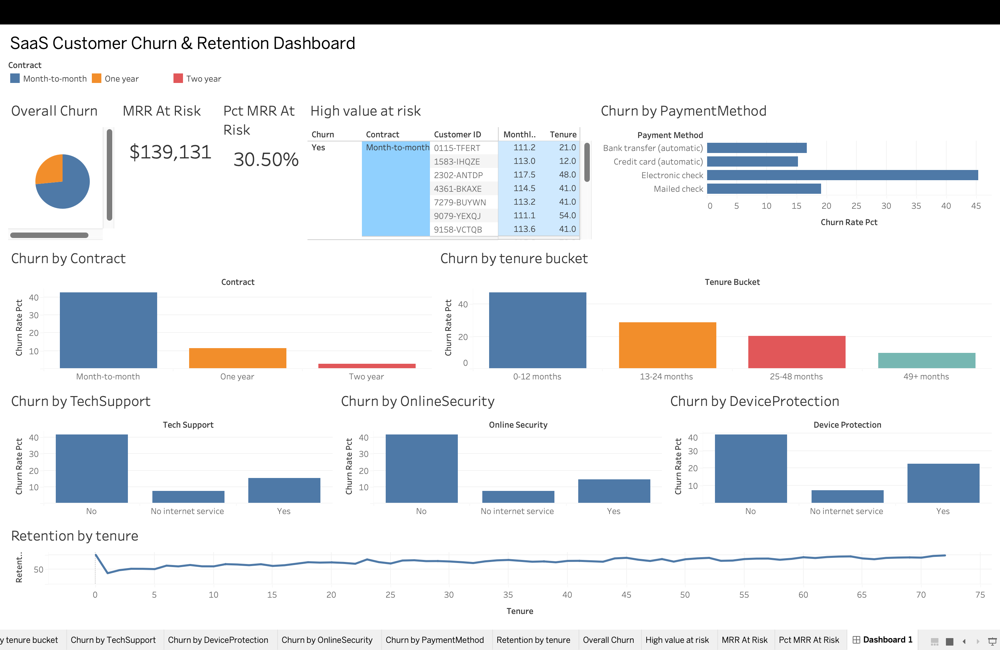

# SaaS Churn Prediction & AI-Driven Retention System

An end-to-end analytics project that identifies at-risk SaaS customers, quantifies revenue at risk, and generates AI-powered retention recommendations.

---

## Business Problem

SaaS companies lose recurring revenue when at-risk customers churn without warning, often because manual monitoring can't keep pace with the volume of accounts. This project identifies the key drivers of churn, quantifies monthly recurring revenue (MRR) at risk, and recommends specific retention actions — proactively, before customers cancel rather than after.

## Objectives

- Identify the key drivers of customer churn
- Quantify monthly recurring revenue (MRR) at risk
- Predict which active customers are likely to churn
- Generate plain-English, actionable retention recommendations using AI
- Present findings in a business-facing, interactive dashboard

Full requirements and user stories are documented in [`/docs/BRD.md`](docs/BRD.md).

## Dataset

This project uses the public **Telco Customer Churn** dataset (Kaggle). While the raw data is from telecom, its subscription/contract/tenure structure closely mirrors SaaS churn patterns (month-to-month vs. annual contracts, recurring monthly billing, add-on services), so it's treated here as a SaaS retention case study.

Source: [Kaggle — Telco Customer Churn](https://www.kaggle.com/datasets/blastchar/telco-customer-churn)

---

## Key Findings

- **Overall churn rate:** 26.54% of customers
- **MRR at risk:** $139,130.85 lost to churned customers (30.5% of total MRR)
- **Contract type is the strongest churn driver:** Month-to-month contracts churn at 42.71% vs. 11.27% for one-year and 2.83% for two-year contracts
- **New customers are highest-risk:** Customers with 0–12 months tenure churn at 47.44% vs. 9.51% for customers past 49 months
- **Missing add-on services correlate with churn:** Customers without Tech Support churn at 41.64% vs. 15.17% with it (similar pattern for Online Security and Device Protection)
- **Payment method signals risk:** Electronic check payers show the highest churn rate at 45.29%, notably higher than automatic payment methods
- **20 high-value customers** above average monthly spend churned in this dataset — see `sql/04_at_risk_customers.sql` (query) and `exports/high_value_at_risk.csv` (results)

---

## Dashboard



**[View Interactive Dashboard on Tableau Public →](https://public.tableau.com/shared/3G64JYXZ8?:display_count=n&:origin=viz_share_link)**

### Chart Selection Rationale

Each visualization was chosen based on the type of relationship in the data, not visual preference:

| Chart | Used For | Why |
|---|---|---|
| Bar (horizontal) | Churn by Contract, Tenure Bucket, Services, Payment Method | Comparing discrete, unordered categories - bar charts let viewers judge relative magnitude accurately across groups |
| Line | Retention by Tenure | Tenure is continuous and sequential - a line reveals the rate of change in retention over time, which a bar chart would flatten and hide |
| Pie | Overall Churn | A simple two-way part-to-whole split; a pie chart communicates "proportion of a whole" faster than a two-bar comparison |
| Big number tile | MRR at Risk, Pct MRR at Risk | A single critical fact needs no visual encoding - clarity over decoration |
| Table | High-Value At-Risk Customers | Individual records with mixed attribute types (ID, tenure, contract, charge) — a table preserves every attribute without forcing a false chart reduction |

---

## Tech Stack

- **Python** (pandas, scikit-learn) — data cleaning and churn prediction model
- **SQLite** — data storage and querying
- **Tableau Public** — dashboard and visualization

## Project Structure

```
├── sql/                  # Business-question queries
│   ├── 01_churn_kpis.sql
│   ├── 02_segmentation.sql
│   ├── 03_cohort_retention.sql
│   └── 04_at_risk_customers.sql
├── exports/              # CSV outputs feeding the dashboard
├── dashboard/            # Tableau workbook + screenshot
│   ├── churn_dashboard.twbx
│   └── screenshot.png
├── docs/                 # BRD
├── main.py               # Data cleaning & import into SQLite
├── requirements.txt
└── README.md
```

---

## Churn Prediction Model — [TODO]
To fill in once built: model type used, train/test split, accuracy/precision/recall, 
top 5 feature importances, and a one-line business interpretation of the top driver.